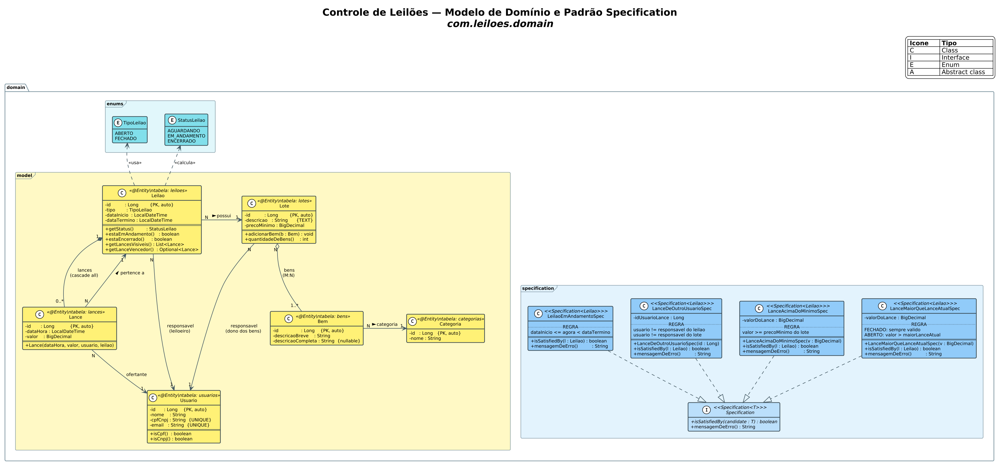
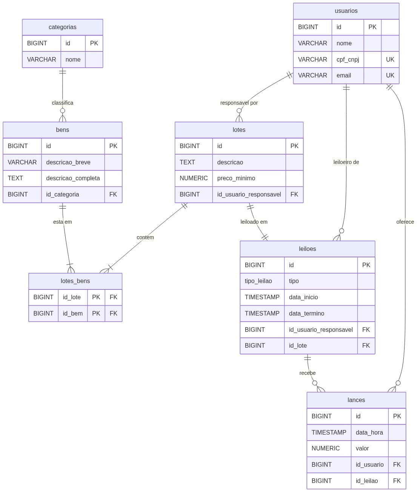

# 🏛️ Padrões de Projeto e Arquitetura do Sistema

Este documento descreve detalhadamente a arquitetura em camadas do sistema de **Controle de Leilões** e explica os padrões de projeto adotados no desenvolvimento da solução, apontando sua localização exata no código-fonte.

---

## 🖼️ Diagrama de Classes UML (Arquitetura de Camadas)

O diagrama de classes abaixo ilustra como as classes estão agrupadas logicamente em pacotes e separadas de acordo com a responsabilidade de cada camada do sistema.

---

## 🖼️ Modelo Relacional do Banco de Dados (ERD)

O diagrama a seguir exibe a estrutura lógica da base de dados física no PostgreSQL, detalhando tabelas, colunas, tipos de dados, chaves primárias (PK), chaves estrangeiras (FK) e chaves únicas (UK).

---

## 🧩 Padrões de Projeto Adotados

### 1. Padrão MVC (Model-View-Controller)
O padrão **MVC** é utilizado na camada de apresentação para gerenciar o fluxo de dados entre a interface e os serviços:
- **Model (Record DTOs e Entidades)**: Encapsula as informações enviadas e recebidas das páginas (ex: [LoteInput](../src/main/java/com/leiloes/dto/input/LoteInput.java) e [LeilaoResumo](../src/main/java/com/leiloes/dto/output/LeilaoResumo.java)).
- **View (Thymeleaf)**: Templates HTML5 premium localizados em `src/main/resources/templates/` que geram o HTML dinamicamente a partir dos atributos populados no modelo.
- **Controller (Spring MVC)**: As classes em [com.leiloes.controller](../src/main/java/com/leiloes/controller/) (como [LeilaoController](../src/main/java/com/leiloes/controller/LeilaoController.java) e [LanceController](../src/main/java/com/leiloes/controller/LanceController.java)) recebem as requisições HTTP, delegam o processamento de regras para os serviços e definem qual página Thymeleaf renderizar.

### 2. Domain Model Pattern (Modelo de Domínio Rico)
As entidades de domínio localizadas no pacote `com.leiloes.domain.model` não são objetos anêmicos (sem comportamento). Elas encapsulam lógicas de negócio cruciais:
- [Leilao.java](../src/main/java/com/leiloes/domain/model/Leilao.java) encapsula métodos como `estaEmAndamento()`, `estaEncerrado()`, `getStatus()`, `getLancesVisiveis()` e `getLanceVencedor()`.
- [Usuario.java](../src/main/java/com/leiloes/domain/model/Usuario.java) contém comportamento para diferenciar o formato de CPF ou CNPJ.

### 3. Repository Pattern (Encapsulamento de Persistência)
Toda a comunicação com o banco de dados PostgreSQL é encapsulada em interfaces no pacote `com.leiloes.repository` estendendo o `JpaRepository` do Spring Data JPA. Isso permite isolar completamente a persistência da lógica de negócio:

- **`SELECT NEW` (JPQL)** em [LeilaoRepository](../src/main/java/com/leiloes/repository/LeilaoRepository.java) projeta joins complexos diretamente nos DTOs de saída em uma única query, eliminando o problema N+1 que ocorreria ao carregar entidades completas com relações lazy.
- **`@Lock(LockModeType.PESSIMISTIC_WRITE)`** em `findByIdForUpdate()` emite um `SELECT ... FOR UPDATE` no PostgreSQL, bloqueando a linha do leilão durante o registro do lance e eliminando a *race condition* em lances simultâneos.
- **Query nativa com `LIMIT 1`** em [LanceRepository](../src/main/java/com/leiloes/repository/LanceRepository.java) recupera o lance vencedor diretamente no banco. JPQL não suporta `LIMIT`, por isso a query é nativa; e como queries nativas não permitem `SELECT NEW`, o resultado é mapeado via interface de projeção [LanceVencedorProjection](../src/main/java/com/leiloes/repository/LanceVencedorProjection.java), que o Spring Data preenche automaticamente por proxy.

### 4. Specification Pattern (Validações desacopladas)
Utilizado para isolar e encapsular regras de negócio e validações individuais de lances. Isso evita o acúmulo de IFs aninhados nos serviços e simplifica a escrita de testes de unidade:
- Interface base: [Specification](../src/main/java/com/leiloes/domain/specification/Specification.java).
- Implementações concretas de especificações:
  - [LeilaoEmAndamentoSpec](../src/main/java/com/leiloes/domain/specification/LeilaoEmAndamentoSpec.java): Verifica se o leilão está ativo de acordo com as datas.
  - [LanceAcimaDoMinimoSpec](../src/main/java/com/leiloes/domain/specification/LanceAcimaDoMinimoSpec.java): Garante que a oferta é superior ao preço mínimo do lote.
  - [LanceDeOutroUsuarioSpec](../src/main/java/com/leiloes/domain/specification/LanceDeOutroUsuarioSpec.java): Impede lances dados pelo criador do leilão ou dono dos bens do lote.
  - [LanceMaiorQueLanceAtualSpec](../src/main/java/com/leiloes/domain/specification/LanceMaiorQueLanceAtualSpec.java): Exige que novos lances em leilões abertos superem o lance mais alto atual.

### 5. DTO (Data Transfer Object) com Java Records
A comunicação de dados entre a camada de apresentação e a camada de serviços é feita de forma limpa por meio de records imutáveis do Java no pacote `com.leiloes.dto`:
- **Input DTOs**: [LanceInput](../src/main/java/com/leiloes/dto/input/LanceInput.java) e [LeilaoInput](../src/main/java/com/leiloes/dto/input/LeilaoInput.java) validam e isolam dados de entrada de formulários.
- **Output DTOs**: [LeilaoDetalhe](../src/main/java/com/leiloes/dto/output/LeilaoDetalhe.java) e [LanceDetalhe](../src/main/java/com/leiloes/dto/output/LanceDetalhe.java) preparam os dados formatados sob medida para as telas Thymeleaf.
